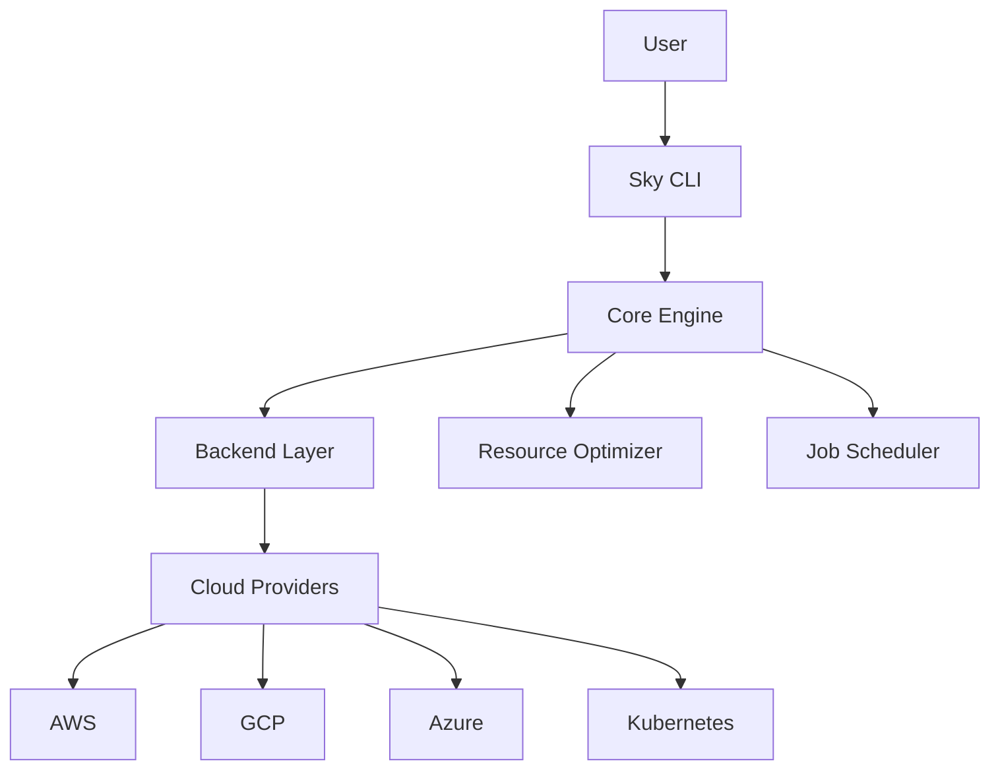

# Architecture Overview

This document provides a quick overview of the comprehensive architecture documentation available for EchoSkyPilot.

## Architecture Documentation

EchoSkyPilot now includes comprehensive technical architecture documentation with interactive Mermaid diagrams covering:

### System Architecture
- High-level system overview and component relationships
- Core engine architecture and module dependencies  
- Multi-cloud provider integration patterns
- Backend and execution environment design

### Operational Workflows  
- Job lifecycle management and state transitions
- Data flow and synchronization processes
- Auto-scaling and load balancing logic
- Security and authentication flows

### Developer Resources
- Module structure and class relationships
- Extension patterns for new backends and cloud providers  
- Testing architecture and development workflows
- Configuration management hierarchy

## Quick Start

To explore the architecture:

1. **[Technical Architecture](architecture.md)** - Comprehensive system overview with detailed Mermaid diagrams
2. **[Developer Architecture Guide](developers/architecture-guide.md)** - In-depth developer documentation for contributors

## Example: System Overview

Here's a simple example of the architectural documentation style:

The full documentation contains much more detailed diagrams covering all aspects of the system architecture.

## Benefits

This architectural documentation provides:

- **Clear Understanding**: Visual representation of complex system interactions
- **Developer Onboarding**: Structured guide for new contributors
- **System Maintenance**: Reference for debugging and optimization
- **Extension Planning**: Patterns for adding new features and integrations

Visit the full architecture documentation to explore the complete system design.