# EchoSkyPilot Technical Architecture

This document provides comprehensive technical architecture documentation for EchoSkyPilot, a framework for running AI workloads on any cloud infrastructure through a unified interface.

## Table of Contents

- [System Overview](#system-overview)
- [High-Level Architecture](#high-level-architecture)  
- [Core Components](#core-components)
- [Cloud Provider Integration](#cloud-provider-integration)
- [Job Lifecycle Management](#job-lifecycle-management)
- [Data Flow Architecture](#data-flow-architecture)
- [Backend Architecture](#backend-architecture)
- [Serving Architecture](#serving-architecture)
- [API Architecture](#api-architecture)
- [Security Architecture](#security-architecture)

## System Overview

EchoSkyPilot is a cloud-agnostic orchestration platform that abstracts away the complexities of running AI/ML workloads across multiple cloud providers and infrastructure types. It provides a unified interface for resource management, job scheduling, and workload execution.

### Key Design Principles

- **Cloud Agnostic**: Single interface for multiple cloud providers
- **Cost Optimization**: Intelligent resource selection and spot instance management  
- **Fault Tolerance**: Auto-recovery and preemption handling
- **Scalability**: Multi-node and distributed execution support
- **Developer Experience**: Simple YAML-based task definitions

## High-Level Architecture

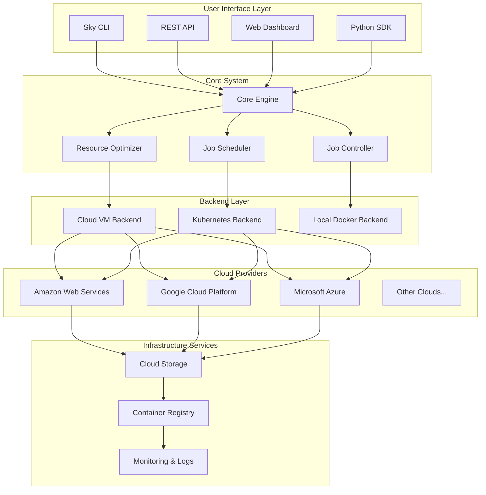

## Core Components

### Core Engine Architecture

```mermaid
graph TB
    subgraph "Sky Core Module"
        Launch[launch()]
        Exec[exec()]
        Stop[stop()]
        Status[status()]
        Down[down()]
    end
    
    subgraph "Task Management"
        Task[Task Definition]
        DAG[DAG Construction]
        Resources[Resource Requirements]
        Validation[Task Validation]
    end
    
    subgraph "Resource Management"
        Catalog[Cloud Catalog]
        Pricing[Pricing Engine]
        Availability[Availability Checker]
    end
    
    Launch --> Task
    Task --> DAG
    DAG --> Resources
    Resources --> Validation
    
    Launch --> Catalog
    Catalog --> Pricing
    Pricing --> Availability
    
    Exec --> Status
    Stop --> Down
```

### Component Relationships

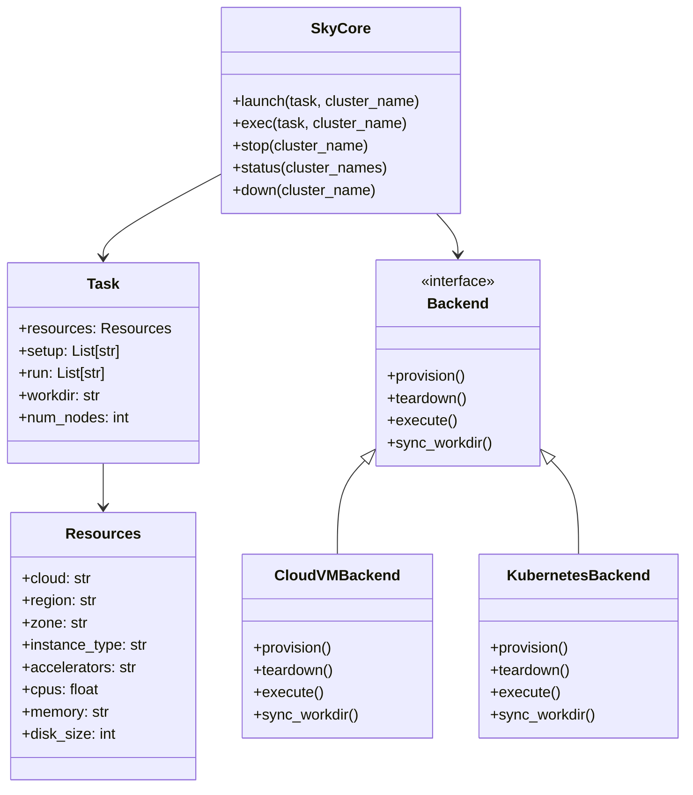

## Cloud Provider Integration

### Cloud Adapter Architecture

```mermaid
graph TB
    subgraph "Cloud Abstraction Layer"
        CloudInterface[Cloud Interface]
        Provisioner[Provisioner]
        Authenticator[Authentication]
    end
    
    subgraph "AWS Integration"
        AWSCloud[AWS Cloud Adapter]
        EC2[EC2 Provisioner]
        IAM[IAM Auth]
        S3[S3 Storage]
    end
    
    subgraph "GCP Integration"  
        GCPCloud[GCP Cloud Adapter]
        Compute[Compute Engine]
        GCPAuth[Service Account Auth]
        GCS[Cloud Storage]
    end
    
    subgraph "Azure Integration"
        AzureCloud[Azure Cloud Adapter] 
        VM[Virtual Machines]
        AzureAuth[Azure AD Auth]
        Blob[Blob Storage]
    end
    
    subgraph "Kubernetes Integration"
        K8sCloud[Kubernetes Adapter]
        Pods[Pod Management]
        K8sAuth[RBAC Auth]
        PVC[Persistent Volumes]
    end
    
    CloudInterface --> AWSCloud
    CloudInterface --> GCPCloud
    CloudInterface --> AzureCloud
    CloudInterface --> K8sCloud
    
    Provisioner --> EC2
    Provisioner --> Compute
    Provisioner --> VM
    Provisioner --> Pods
    
    Authenticator --> IAM
    Authenticator --> GCPAuth
    Authenticator --> AzureAuth
    Authenticator --> K8sAuth
```

### Multi-Cloud Resource Selection

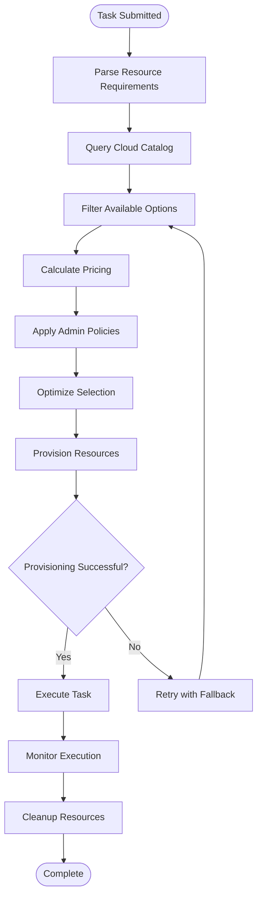

## Job Lifecycle Management

### Job State Machine

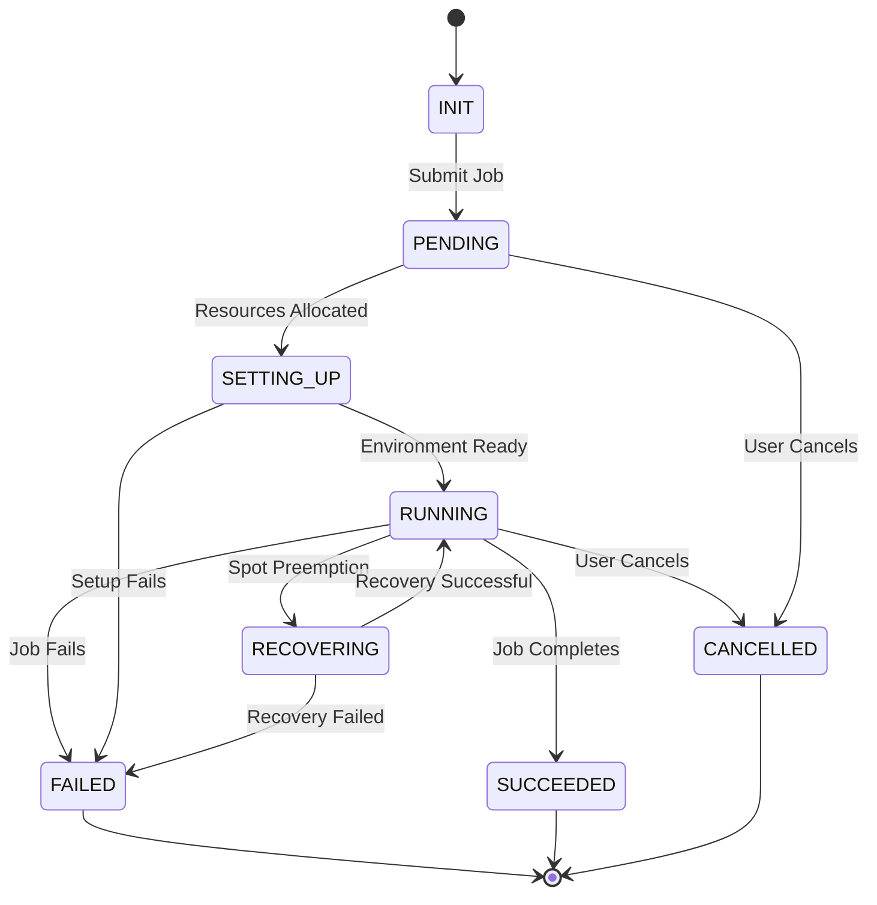

### Managed Jobs Architecture

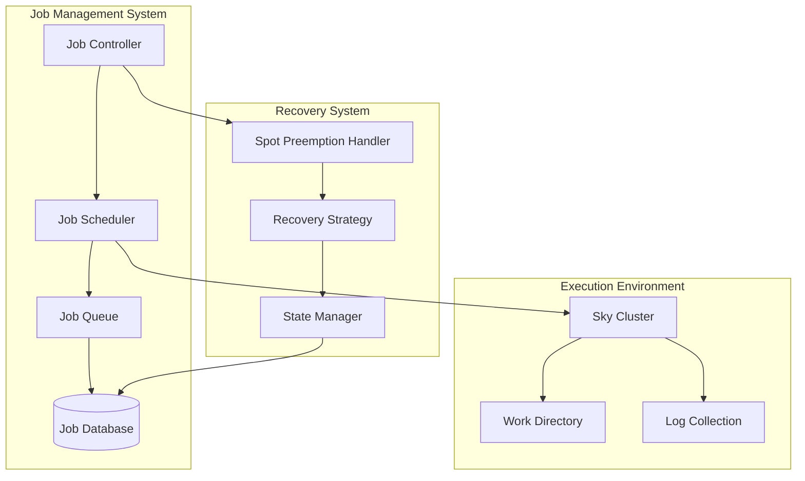

## Data Flow Architecture

### Task Execution Flow

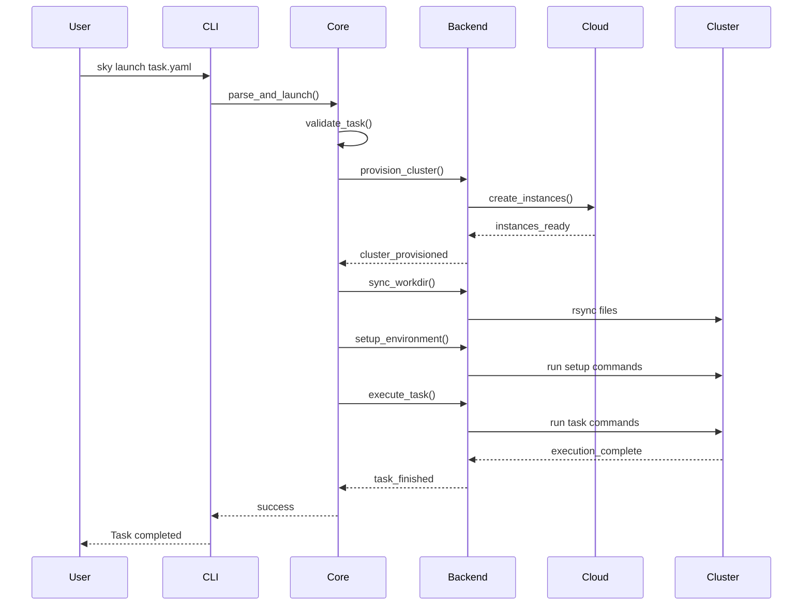

### Data Synchronization Flow

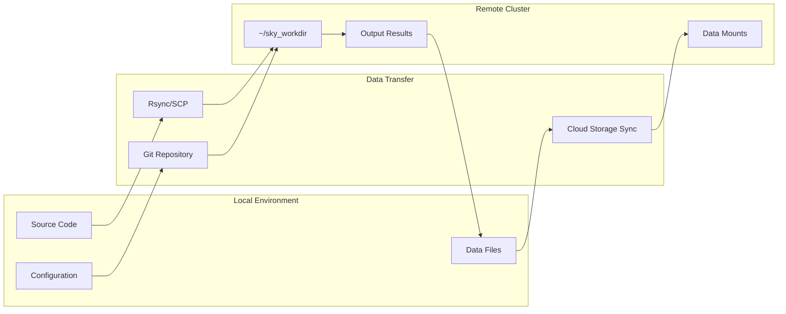

## Backend Architecture

### Backend Interface Design

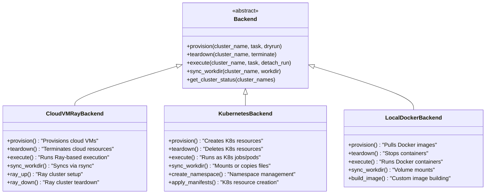

### Execution Environment Setup

```mermaid
flowchart TD
    Start[Backend.provision()] --> CheckCloud[Check Cloud Availability]
    CheckCloud --> CreateResources[Create Cloud Resources]
    CreateResources --> WaitReady[Wait for Resources Ready]
    WaitReady --> InstallDeps[Install Dependencies]
    InstallDeps --> SetupRay{Ray Backend?}
    SetupRay -->|Yes| RayInit[Initialize Ray Cluster]
    SetupRay -->|No| K8sSetup{Kubernetes Backend?}
    K8sSetup -->|Yes| PodSetup[Setup Pod/Job]
    K8sSetup -->|No| DockerSetup[Setup Docker Container]
    RayInit --> SyncFiles[Sync Workdir]
    PodSetup --> SyncFiles
    DockerSetup --> SyncFiles
    SyncFiles --> Ready[Environment Ready]
```

## Serving Architecture

### Model Serving Pipeline

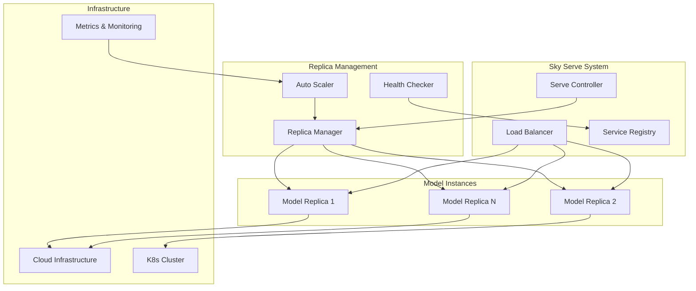

### Request Flow

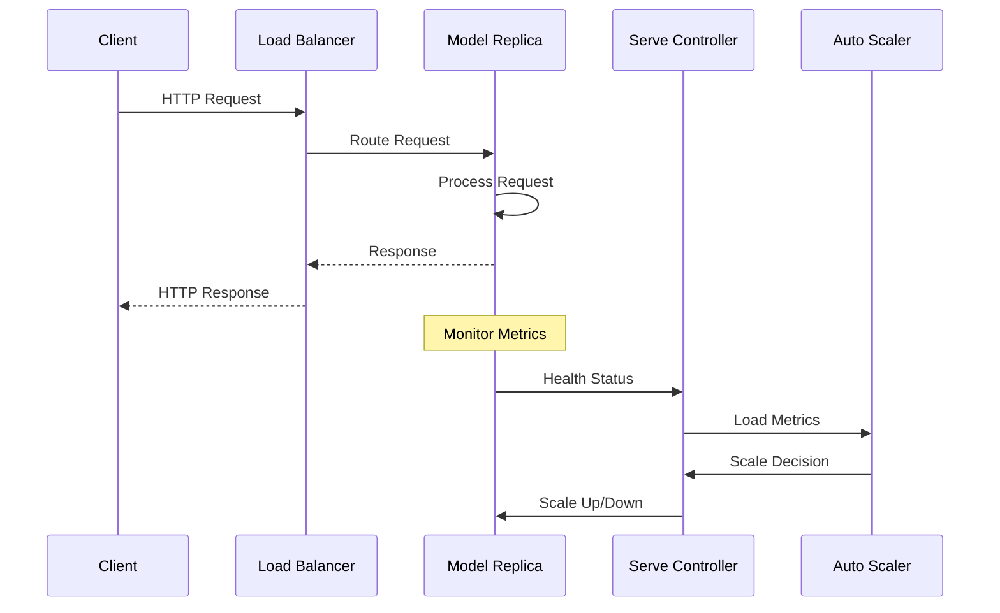

## API Architecture

### REST API Design

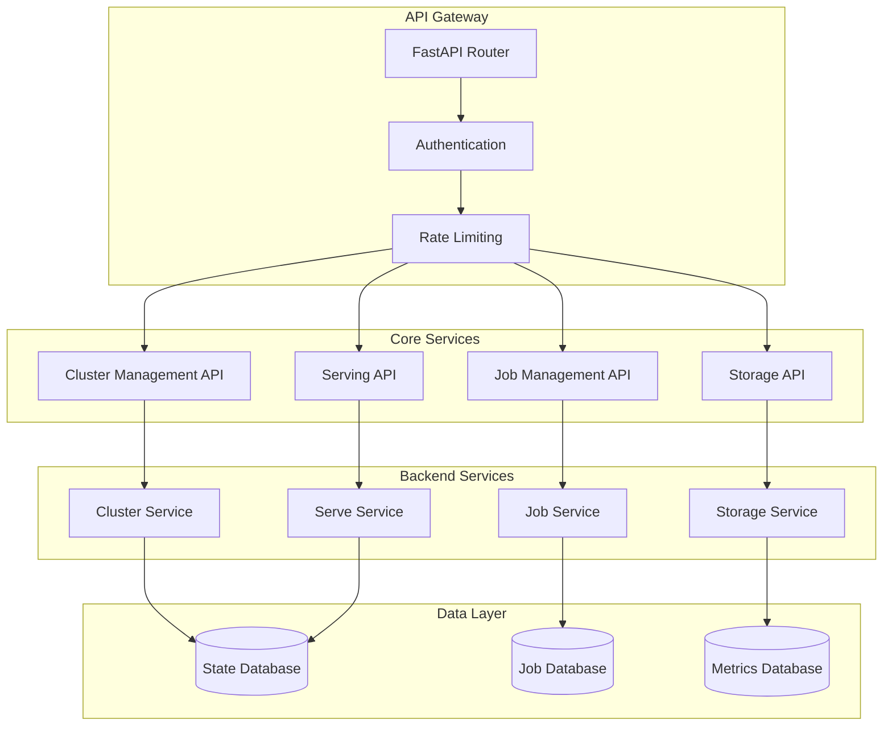

### API Endpoints Structure

```mermaid
mindmap
  root((Sky API))
    Clusters
      GET /clusters
      GET /clusters/{name}
      POST /clusters
      DELETE /clusters/{name}
      POST /clusters/{name}/exec
    Jobs
      GET /jobs  
      GET /jobs/{id}
      POST /jobs
      DELETE /jobs/{id}
      POST /jobs/{id}/cancel
    Serve
      GET /serve/services
      POST /serve/services
      DELETE /serve/services/{name}
      GET /serve/services/{name}/replicas
    Storage
      GET /storage
      POST /storage/upload
      GET /storage/{path}
      DELETE /storage/{path}
```

## Security Architecture

### Authentication & Authorization Flow

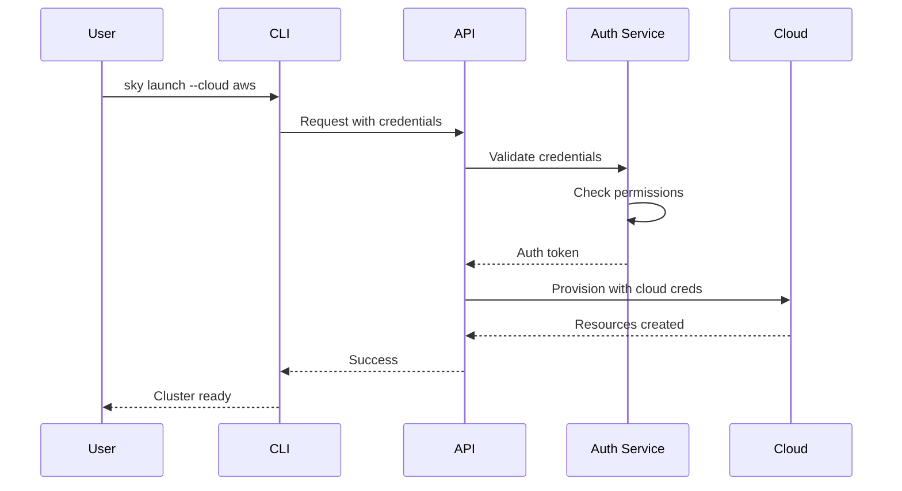

### Multi-Cloud Credential Management

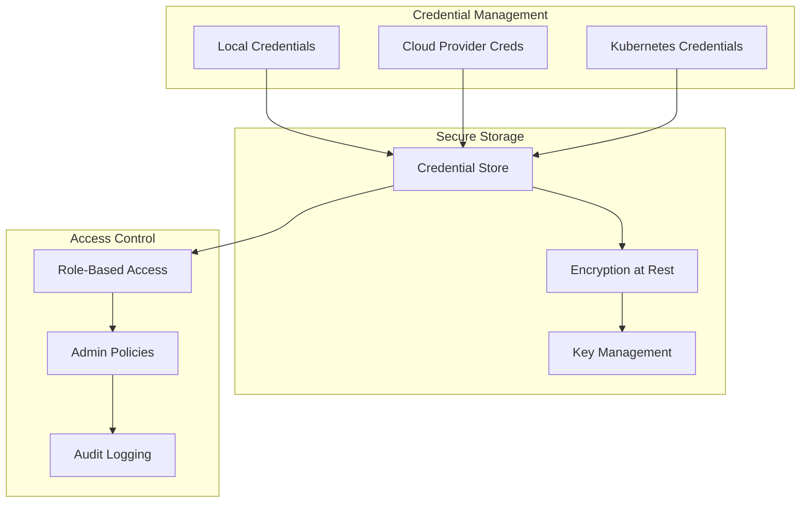

## Summary

EchoSkyPilot's architecture is designed around several key principles:

1. **Modularity**: Clear separation between core logic, backends, and cloud adapters
2. **Extensibility**: Plugin architecture for adding new cloud providers and backends
3. **Resilience**: Built-in fault tolerance and recovery mechanisms
4. **Performance**: Optimized resource selection and efficient data transfer
5. **Security**: Comprehensive credential management and access controls

The system successfully abstracts the complexity of multi-cloud deployment while providing powerful features for AI workload orchestration, cost optimization, and operational simplicity.