# Developer Architecture Guide

This guide provides detailed technical information for developers working on EchoSkyPilot.

## Module Structure

### Core Module Dependencies

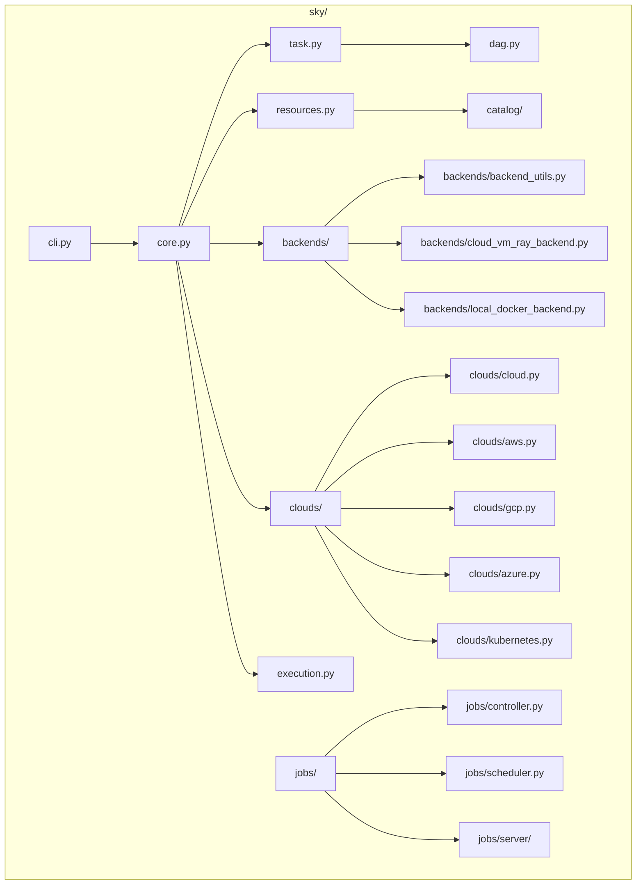

### Key Classes and Interfaces

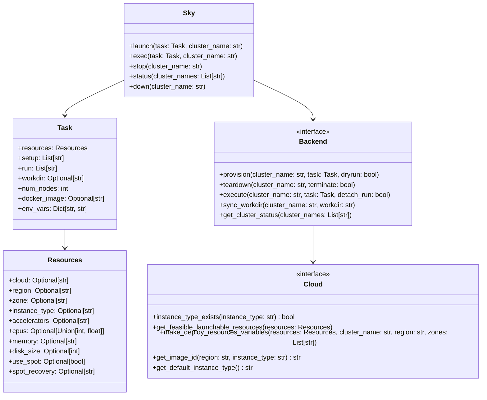

## Backend Implementation Guide

### Creating a New Backend

To add a new backend, implement the `Backend` interface:

```python
from sky.backends import backend

class MyCustomBackend(backend.Backend):
    """Custom backend implementation."""
    
    def __init__(self):
        super().__init__()
        
    def provision(self, cluster_name: str, task: 'Task', dryrun: bool = False):
        """Provision resources for the cluster."""
        # Implementation here
        pass
        
    def teardown(self, cluster_name: str, terminate: bool = False):
        """Tear down the cluster.""" 
        # Implementation here
        pass
        
    def execute(self, cluster_name: str, task: 'Task', detach_run: bool = False):
        """Execute the task on the cluster."""
        # Implementation here  
        pass
        
    def sync_workdir(self, cluster_name: str, workdir: str):
        """Sync local workdir to remote cluster."""
        # Implementation here
        pass
```

### Backend Selection Logic

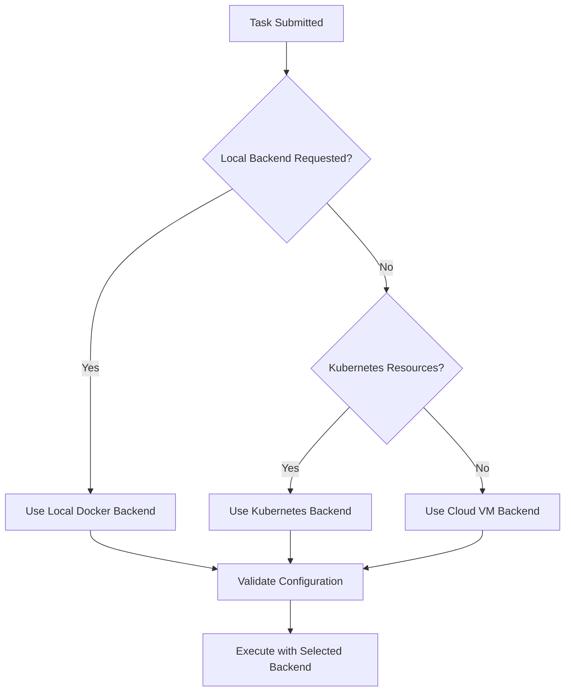

## Cloud Provider Integration

### Adding a New Cloud Provider

1. **Create Cloud Adapter**: Implement the `Cloud` interface in `sky/clouds/`

```python
from sky.clouds import cloud

class MyCloud(cloud.Cloud):
    """My custom cloud provider."""
    
    @classmethod  
    def _cloud_unsupported_features(cls):
        """Return unsupported features for this cloud."""
        return {
            cloud.CloudImplementationFeatures.STOP: 'My cloud does not support stopping instances.',
            cloud.CloudImplementationFeatures.MULTI_NODE: 'Multi-node not yet supported.',
        }
    
    def instance_type_exists(self, instance_type: str) -> bool:
        """Check if instance type exists."""
        # Implementation here
        pass
        
    def get_feasible_launchable_resources(self, resources):
        """Get feasible resources for launching."""
        # Implementation here
        pass
```

2. **Add Provisioning Logic**: Create provisioner in `sky/provision/mycloud/`

3. **Update Registry**: Register the cloud in `sky/clouds/__init__.py`

### Cloud Integration Architecture

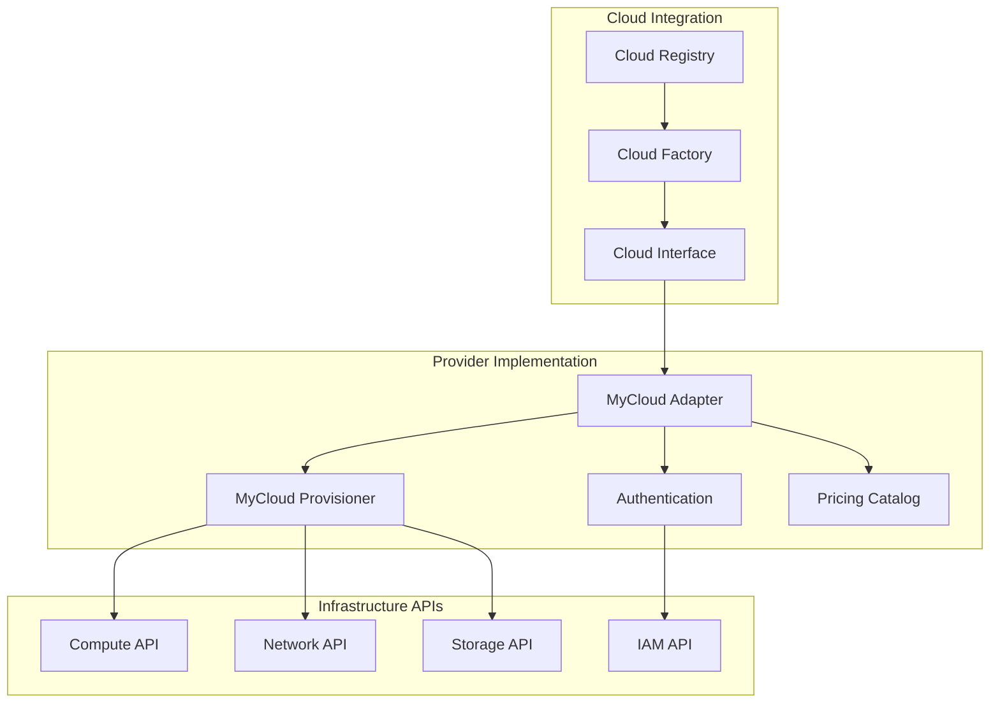

## Job Management System

### Managed Jobs Architecture

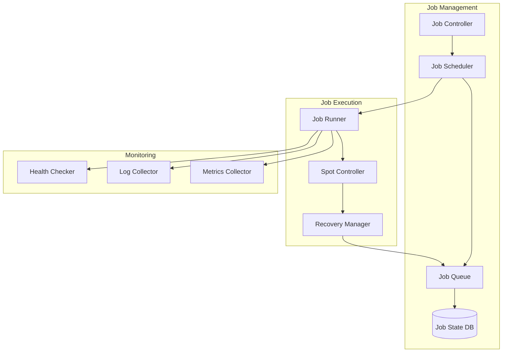

### Job State Management

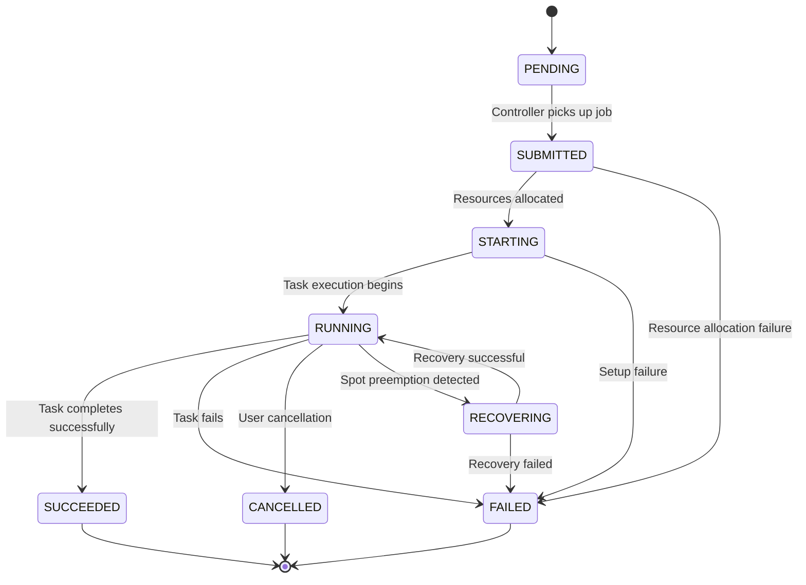

## Serving System

### Model Serving Components

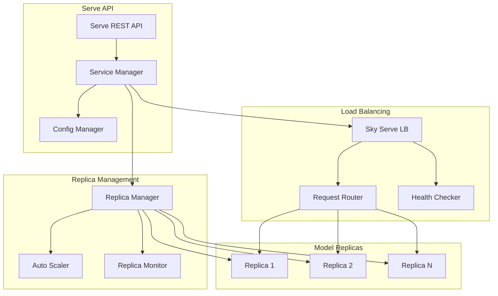

### Auto-scaling Logic

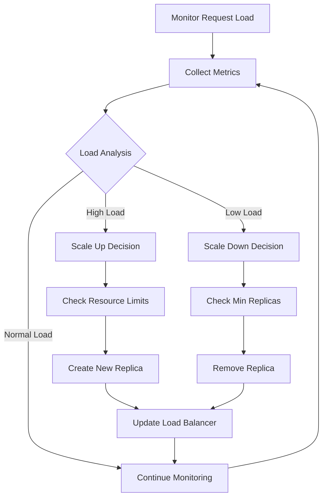

## Data Management

### Storage Integration

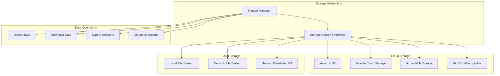

## Configuration Management

### Configuration Hierarchy

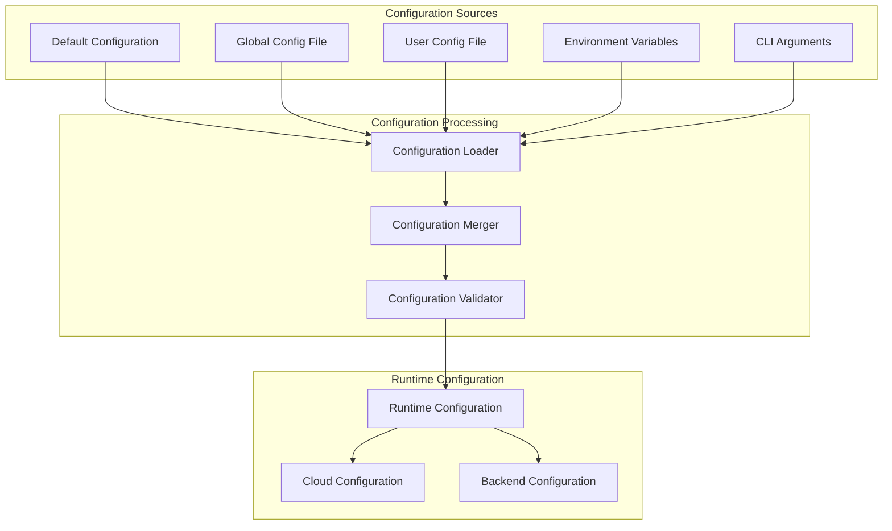

## Testing Architecture

### Test Structure

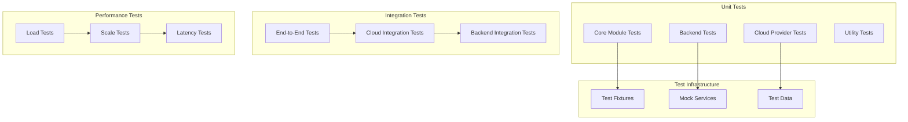

## Development Workflow

### Code Contribution Flow

```mermaid
gitgraph
    commit id: "main"
    branch feature
    checkout feature
    commit id: "Start feature"
    commit id: "Implement changes"
    commit id: "Add tests"
    commit id: "Update docs"
    checkout main
    commit id: "Other changes"
    checkout feature
    merge main
    commit id: "Fix conflicts"
    checkout main
    merge feature
    commit id: "Merge feature"
```

### Build and Release Pipeline

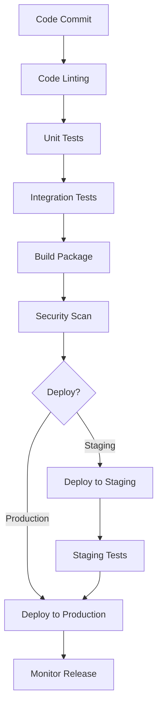

This architecture guide provides the foundation for understanding and contributing to EchoSkyPilot's codebase. For specific implementation details, refer to the inline code documentation and examples in the repository.